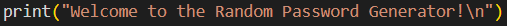
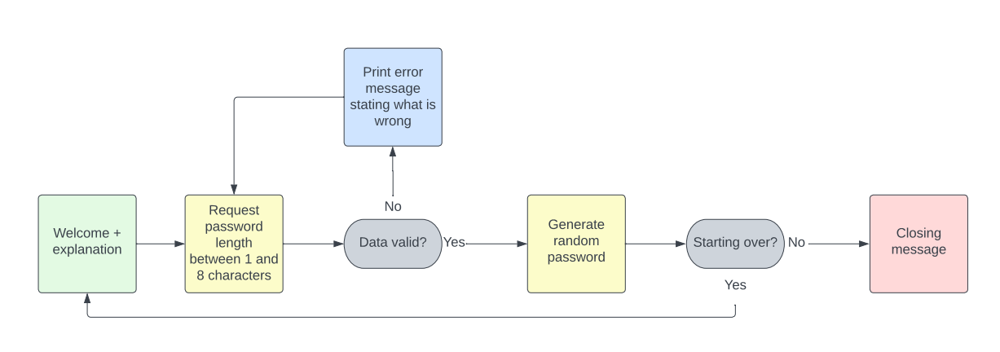
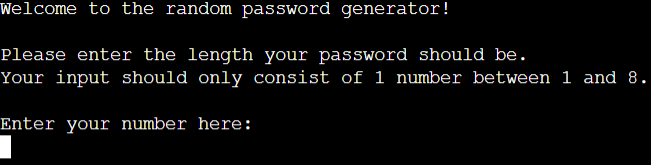
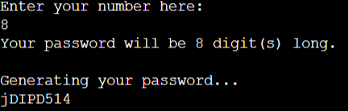
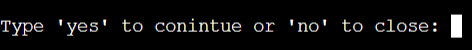
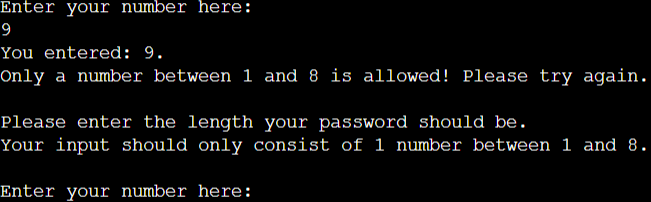
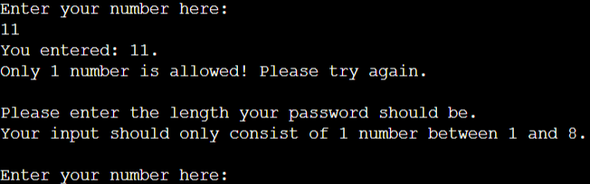
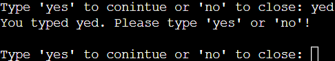
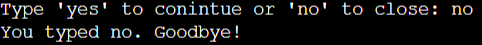
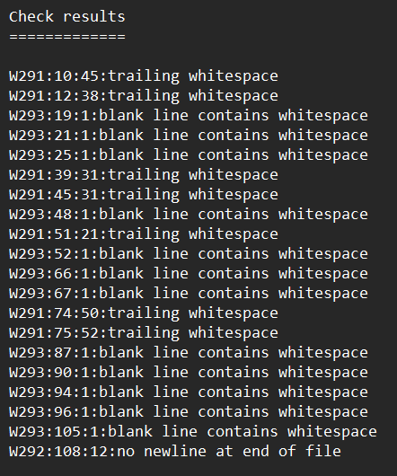

# __The Random Password Generator__

Welcome to the Random Password Generator application! This application is specially designed to quickly generate a fully random password of any length between 1 and 8 characters using the 'Ascii' character encoding. This application has been fully written in the Python language and has been deployed to the 'Heroku' web application deployment provider. 

## __Features__

In this chapter, I will go over the Random Password Generator application existing features and future features that still need to be implemented. The features can be explained on the basis of the following flow chart:

### __Existing features__

- __The start screen__
  
The initial screen when starting the application is rather simple but useful. The first line of text welcomes you to the application and introduces the name of the application. A white line has been intentionally used below the the welcome line to improve the tidiness. 

Secondly, a small explanation is given on how to use the application. The application asks you to state how long you want your randomly generated password to be. The application is coded in such a way that it only accepts requests for passwords between 1 and 8 characters long. Another white line under the explanation is used for the same reason as the first white line.

Below this white line, the input section is showns asking the user to fill in a number as described in the explanation.

- __The generating screen__

After typing in the password length of your choice, and pressing the return key, the program will start to run. A line will tell the user which number has been selected and another line will tell the user the application is generating a fully random password. The result will be shown just below this explanation. 

- __The question screen__

Simultaneously with displaying the generated password, a question will be displayed underneath asking the user to continue or not. The only valid answers are 'yes' or 'no'. Failing to do so will end up in an error message explaining the application will only respond to those words. 

  

- __The error screens__

The application consists of 3 error messages:
  1. An error message when a number has been chosen out of the range that was stated in the explanation (from 1 to 8).
  2. An error message when more than 1 number has been chosen as only the numbers between 1 and 8 are valid.
  3. An error message when another word than 'yes' or 'no' have been typed in. This error message will also be displayed when    upper case letters have been used. 

Error message 1

  

Error message 2

  

Error message 3

  

- __The exit screen__

Whenever the user answers 'no' into the input field when the question to continue or not has been raised, the application will automatically shut down. A line will be shown stating the user have typed 'no' and saying 'goodbye!'. 

### __Features left to implement__

In this chapter, I will describe some of the features that are not implemented at this moment, but will possibly be implemented in the future. 

  - More complex random passwords using also special characters (examples of some special characters are: !@#$%^&*).
  - Longer passwords. Maybe even infinite ones!
  - Generating more passwords at the same time.

## __Testing__

The application have both been fully tested inside the gitpod environment as well as in the heroku environment. No unexpected behavior have been encountered. Even when the input consisted of multiple lines of characters, the application raised the right error message and continued to function. 

### __Unfixed bugs__

 The application has no serious bugs. However, there are a total of 45 so called 'problems' encountered in the gitpod environment. Most of the problems are of the same nature, telling the programmer there's multiple blank lines containing white space and trailing whitespaces. Some of the problems are shown below. The same problems were encountered during the pep8 online test on http://pep8online.com/. The test results will be posted below.

 

## __Deployment__
- The site was deployed to Heroku. The steps to deploy are as follows:
  - Created an account using my personal email address (johanvanerkel@gmail.com) and selected 'create new app' from the home screen.
  - Chose the following app name: portfolio-3-password-generator and selected 'Europe' as region.
  - Selected the right settings as explained in walk through project videos.
  - Deployed project by connecting my heroky account to my github account (same email address used for github)
  - Heroku generated a web address to visit the web application which I will state here:
    https://portfolio-3-password-generator.herokuapp.com/

## __Credits__

Inititally I googled for some good beginner python project ideas but I came quickly to the conclusion that I should use the same source of inspiration I used during my research phase of the previous portfolio project. During this project, I came across a 'Udemy' course (udemy is a platform providing courses made by other users of the platform) from a company called 'Bluelime Learning Solutions' offering 17 beginner Javascript project ideas. Here I found the perfect project idea for my second portfolio project. I searched again and I was in luck! The same company offered a similar course for python offering 10 beginner project ideas! 1 of the projects was a random password generator.

Naturally, I can assure that my code is fully unique. I only used the idea from the course that I mentioned in the previous alinea and the layout from the Code Institute walkthrough project since this layout is just very good. Of course, I encountered some difficulties along the way where I needed tutor support, but nonetheless, all the code has been written by myself. 

For research and support, I also used the following websites:
- https://www.w3schools.com/ (used to gather information)
- https://developer.mozilla.org/ (used to gather information) 
- https://stackoverflow.com/ (forum for asking questions)

I also got information from Youtube. My favorite used youtube channels are as follows:
- Programming with Mosh
- Web Dev Simplified
- freeCodeCamp.org

## __Epilogue__

Thank you for taking the time to read through this README, my code and of course the end result of the Random Password Generator application. I hope you find the end result inspiring as well!